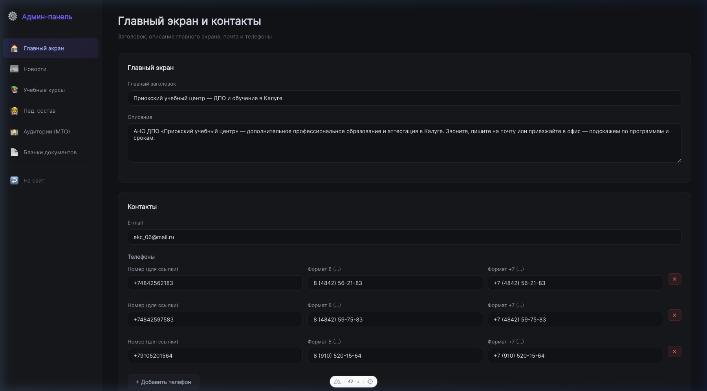
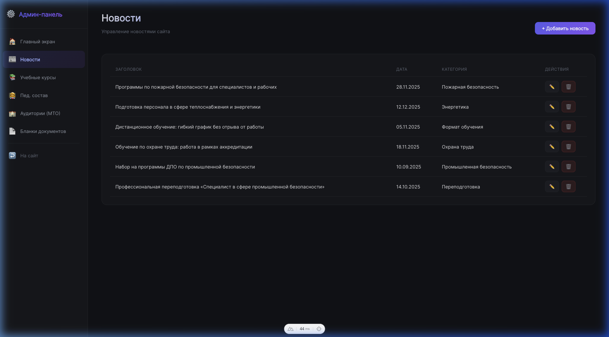
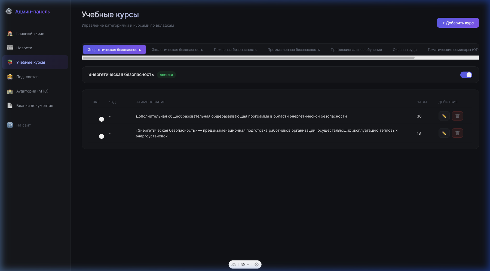

# Walkthrough: Админ-панель для управления сайтом

## Что было сделано

Создана полнофункциональная админ-панель (CMS) внутри текущего Nuxt-проекта для управления всем контентом сайта образовательного центра.

---

## 1. База данных (Prisma + SQLite)

### schema.prisma
Создана схема с 9 моделями:
- **Settings** + **Phone** — заголовок, описание, email, телефоны
- **News** — новости со slug, текстом, категорией
- **Category** — категории курсов (вкл/выкл)
- **Course** — курсы со всеми полями (код, часы, описание, формат, периодичность, кто должен проходить, требования, файлы)
- **CourseDocument** — документы внутри курса
- **Teacher** — педагогический состав (имя, диплом, удостоверение, программы)
- **Classroom** — аудитории МТО
- **DocumentBlank** — бланки документов

### seed.ts
Скрипт миграции данных из существующих `.ts` файлов в SQLite базу:
- **8 категорий** учебных программ
- **262 курса** (от пожарной безопасности до охраны труда)
- **6 новостей**
- **Настройки**: заголовок, описание, email, 3 телефона

---

## 2. Серверное API (Nitro)

### Публичные эндпоинты (GET):
| Эндпоинт | Описание |
|---|---|
| `/api/settings` | Настройки сайта + телефоны |
| `/api/news` | Все новости |
| `/api/categories` | Категории с курсами (только вкл.) |
| `/api/teachers` | Педагогический состав |
| `/api/classrooms` | Аудитории |
| `/api/documents` | Бланки документов |

### Админские CRUD эндпоинты:
| Эндпоинт | Методы |
|---|---|
| `/api/admin/settings` | PUT |
| `/api/admin/news` | POST |
| `/api/admin/news/[id]` | PUT, DELETE |
| `/api/admin/categories` | GET, POST |
| `/api/admin/categories/[id]` | PUT |
| `/api/admin/courses` | POST |
| `/api/admin/courses/[id]` | PUT, DELETE |
| `/api/admin/teachers` | GET, POST |
| `/api/admin/teachers/[id]` | PUT, DELETE |
| `/api/admin/classrooms` | GET, POST |
| `/api/admin/classrooms/[id]` | PUT, DELETE |
| `/api/admin/documents` | GET, POST |
| `/api/admin/documents/[id]` | PUT, DELETE |
| `/api/admin/upload` | POST (multipart) |

---

## 3. Интерфейс админ-панели

Доступ: **`http://localhost:3030/puc/admin`**

### Скриншоты

#### Главный экран — редактирование заголовка, описания, email и телефонов


#### Новости — список с кнопками редактирования и удаления


#### Учебные курсы — вкладки по категориям с переключателями вкл/выкл


### Страницы:

| Страница | Путь | Функционал |
|---|---|---|
| Главный экран | `/admin` | Редактирование заголовка, описания, email, телефонов |
| Новости | `/admin/news` | CRUD новостей (заголовок, текст, категория, slug) |
| Учебные курсы | `/admin/courses` | **Вкладки** по категориям, включение/отключение каждого курса, редактирование всех полей |
| Пед. состав | `/admin/teachers` | Добавление преподавателей с загрузкой дипломов и удостоверений |
| Аудитории | `/admin/classrooms` | Управление 3-мя аудиториями МТО |
| Бланки | `/admin/documents` | Загрузка и управление документами |

---

## 4. Структура созданных файлов

```
prisma/
  schema.prisma          — Схема БД
  seed.ts                — Миграция данных

server/
  utils/prisma.ts        — Singleton PrismaClient
  api/
    settings.get.ts      — Публичный GET
    news.get.ts
    categories.get.ts
    teachers.get.ts
    classrooms.get.ts
    documents.get.ts
    admin/
      settings.put.ts
      news.post.ts
      news/[id].put.ts
      news/[id].delete.ts
      categories.get.ts
      categories.post.ts
      categories/[id].put.ts
      courses.post.ts
      courses/[id].put.ts
      courses/[id].delete.ts
      teachers.ts
      teachers/[id].ts
      classrooms.ts
      classrooms/[id].ts
      documents.ts
      documents/[id].ts
      upload.post.ts

layouts/
  admin.vue              — Тёмный layout с сайдбаром

pages/admin/
  index.vue              — Настройки + Контакты
  news.vue               — Новости
  courses.vue            — Учебные курсы (вкладки)
  teachers.vue           — Пед. состав
  classrooms.vue         — Аудитории МТО
  documents.vue          — Бланки документов
```

---

## Как запустить

```bash
# Установить зависимости
npm install

# Создать/обновить БД и сгенерировать Prisma Client
npx prisma db push && npx prisma generate

# Заполнить БД данными из текущих .ts файлов
npx tsx prisma/seed.ts

# Запустить dev-сервер
npm run dev
```

Админка доступна по адресу: **`/puc/admin`**
